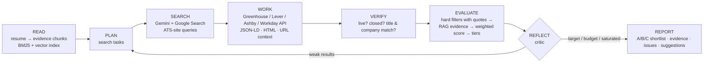

# 🧭 JobPilot

**An evidence-grounded, self-correcting job-matching agent.**
JobPilot searches the live web for real, currently open US job postings, verifies every lead against the employer's
own ATS page, filters out hard conflicts, matches each requirement to verbatim evidence pulled from your resume
(RAG), scores what's left, and re-plans its own search when the results are weak.

中文界面默认开启，可随时切换 English / Bilingual UI (中文 / English), toggle anytime.

[](#requirements)
[](#requirements)
[](#testing)
[](#license)

---

## Table of contents

- [Why JobPilot](#why-jobpilot)
- [How it works](#how-it-works)
- [Hard rules vs. soft signals](#hard-rules-vs-soft-signals)
- [Anti-hallucination guarantees](#anti-hallucination-guarantees)
- [Requirements](#requirements)
- [Getting started](#getting-started)
- [Using the app](#using-the-app)
- [Project layout](#project-layout)
- [Testing](#testing)
- [Cost & limits](#cost--limits)
- [Migrating from the legacy RoleSignal (v1) code](#migrating-from-the-legacy-rolesignal-v1-code)
- [Known issues](#known-issues)
- [Contributing](#contributing)
- [License](#license)

## Why JobPilot

Most "job matching" tools either hallucinate requirements or trust job boards blindly. JobPilot is built around a
single rule: **every claim it makes must be traceable to a quote from the original source.** A posting is only
scored once it has been verified live against the employer's own ATS; a "match" is only shown once the matching
requirement has been located verbatim in your resume.

## How it works



The agent loop (`jobpilot/agent/orchestrator.py`) repeats **SEARCH → WORK → VERIFY → EVALUATE → REFLECT** until it
either hits your target count/budget or the critic decides the search space is saturated, then produces a final
report with a tiered shortlist, evidence matrix, and open issues.

## Hard rules vs. soft signals

| Hard gates (exclude, with quoted evidence) | Soft score dimensions (0–100, weighted) |
|---|---|
| Posting dead / closed / link mismatch | Skills: per-requirement resume evidence (required 1.0, preferred 0.35) |
| Explicit *no sponsorship* / *citizens only* / *clearance* (if you need sponsorship) | Experience & level fit |
| Work mode not selected, location outside your cities (metro-aware), remote but not US | Role alignment (title overlap + embeddings) |
| Seniority ≥ 2 levels away · years required > yours + tolerance | Location / work-mode preference order |
| Employment type · posted before your window · company / title blocklists | Compensation vs. floor · sponsorship likelihood (posting + employer H-1B history) |
| Salary below floor *(off by default)* | Dream company / industry · freshness · your 👍/👎 history |

Unknown facts never cause a rejection — they become warnings and neutral scores. Every hard rule can be switched to
a soft signal from the Setup page. The critic only changes **search strategy** (ATS sites, title synonyms, metro
cities, skill focus, sponsorship-friendly queries, recency) — it never relaxes your constraints, and instead
suggests changes to you in the final report.

## Anti-hallucination guarantees

These are structural checks in the pipeline, not prompt-level promises:

- Search leads are untrusted until **VERIFY** confirms them (public ATS API / HTTP status / closed-posting markers /
  title & company consistency).
- LLM-extracted requirements and sponsorship quotes must appear verbatim in the posting text; resume evidence quotes
  must appear verbatim in the cited chunk — otherwise they're discarded and marked `unverified`, never scored.
- Resume parsing drops any bullet that isn't verbatim in the source document; AI-tailored application bullets are
  checked for numbers/skills that aren't present in the cited evidence before they're shown to you.
- Aggregators (LinkedIn, Indeed, …) are never scraped directly; they're read only via Gemini URL context and capped
  below tier A.

## Requirements

- Python 3.10+ (tested on 3.11, also runs on 3.14)
- A [Gemini API key](https://aistudio.google.com/apikey) — **optional**, the app runs fully in demo mode without one

## Getting started

```bash
pip install -r requirements.txt
cp .env.example .env            # add GEMINI_API_KEY (optional — demo mode works without it)
streamlit run app.py
```

`.env` variables (see [`.env.example`](.env.example)):

| Variable | Purpose | Default |
|---|---|---|
| `GEMINI_API_KEY` | Enables live search/matching; leave blank for demo mode | — |
| `GEMINI_MODEL` | Generation model (Settings → "Test connection" lists what your key can use) | `gemini-3.8-flash` |
| `GEMINI_EMBED_MODEL` | Embedding model for RAG (falls back to local hashing vectors if unavailable) | `gemini-embedding-001` |

Sanity-check your API key end-to-end before a full run:

```bash
python scripts/smoke_gemini.py "Machine Learning Engineer" "Austin, TX"
```

## Using the app

1. **设置档案 / Setup** — upload or paste your resume, review the parsed profile, then fill in targets, hard
   constraints and priorities.
2. **运行 Agent / Run** — the agent runs on a background thread; watch every stage live and stop it at any time.
3. **匹配结果 / Matches** — tiered cards (A apply now · B tailor · C stretch · excluded with reasons), an evidence
   matrix, a verification log, a fact-checked application kit, and 👍/👎 feedback.
4. **投递看板 / Pipeline** and **运行报告 / Reports** — track applications and export a run as Markdown/CSV.

## Project layout

```text
app.py                      Streamlit entry point (top navigation, language toggle)
ui/                          views (profile wizard, run, matches, pipeline, reports, settings), i18n, components, runner
jobpilot/
  schemas.py                Pydantic domain models (profile, preferences, posting, evidence, run report)
  taxonomy.py                dropdown data, skill synonyms, metros, sponsorship & closed-posting patterns
  llm/gemini.py              REST client: google_search + url_context tools, JSON schema, retries, usage metering
  llm/prompts.py             prompts + LLM DTOs
  ingest/resume_parser.py    PDF/DOCX/TXT → profile (LLM with verbatim checks, or offline)
  rag/                       chunker, BM25, embeddings (Gemini + local fallback), hybrid RRF retriever
  search/                    planner, Gemini grounded searcher, ATS adapters, fetcher
  extract/                   heuristics + WORK-stage builder (ATS/JSON-LD/HTML/URL context, LLM refinement)
  verify/verifier.py         liveness & consistency checks
  evaluate/                  hard filters, RAG evidence matcher, scoring & tiers
  agent/                     orchestrator loop, critic, employer sponsorship intel
  report/                    Markdown/CSV export, fact-checked tailoring
  storage/db.py               SQLite (`.jobpilot/jobpilot.db`)
tests/                        unit + end-to-end pipeline tests (simulated Gemini/HTTP) + Streamlit AppTest UI tests
scripts/                      smoke_gemini.py, cleanup_legacy.py
```

## Testing

```bash
python -m unittest discover -s tests -t .
```

The suite covers the agent pipeline end-to-end against simulated Gemini/HTTP responses (`tests/fakes.py`), the core
`jobpilot` modules, and the Streamlit UI via `streamlit.testing.v1.AppTest`. See [Known issues](#known-issues) for
current failures.

## Cost & limits

Gemini 3 models bill Google Search grounding **per executed search query** (with a monthly free allowance); the Run
page shows a pre-run cost estimate and live usage, and you can set a requests-per-minute cap for the free tier. LLM
job-description extraction is only spent on postings that already passed the cheap deterministic filters. See the
[official Gemini pricing page](https://ai.google.dev/pricing) for current numbers.

## Migrating from the legacy RoleSignal (v1) code

This repository previously hosted a CS5588 Stage 1/2/3 comparison project (`agents/`, `data/`, `evals/`, `report/`).
That code is retired in favor of the `jobpilot/` architecture above but still ships in this tree for reference.
Remove it once you no longer need it:

```bash
python scripts/cleanup_legacy.py --yes     # dry run without --yes
# or: git rm -r agents data evals report tests/test_agents.py
```

## Known issues

- `tests/test_ui.py::test_1_wizard_to_demo_run_to_matches` currently fails (`KeyError` on an uninitialized
  `st.session_state` widget key) when run via `streamlit.testing.v1.AppTest` on Streamlit ≥ 1.60 — all other 37
  tests pass. Tracked as a follow-up; contributions welcome.

## Contributing

Issues and pull requests are welcome. Please run the test suite (see [Testing](#testing)) before submitting, and
keep new hard-coded facts (skills, metros, ATS patterns) in `jobpilot/taxonomy.py` rather than scattered across
modules.

## License

No license file is currently included in this repository — all rights reserved by default until one is added. If
you intend to open-source this project, add a `LICENSE` file (e.g. MIT, Apache-2.0) to clarify usage terms for
others.
