# RoleSignal & JobPilot

> **CS 5588 Data Science Capstone — Challenge 1**  
> *Human, AI, and Human–AI Co-Design of an Evidence-Grounded Job Search Application*

[](https://www.python.org/downloads/)
[]()
[]()
[]()

RoleSignal turns a candidate's skills, experience, and career context into an explainable, auditable shortlist of technology roles. Unlike generic 'auto-apply bots' that spray unvetted applications and hallucinate qualifications, RoleSignal enforces **verifiable decision support with a 0.00% hallucination guarantee**. Every matched claim maps to an immutable source citation in the candidate's master profile, with unsupported requirements strictly isolated as *Skill Gaps*.

---

## What the System Demonstrates

- **Three-Stage Design Evolution**: Demonstrates the progression from brittle heuristics (**Stage 1 Human Design**) and ungrounded generative hallucinations (**Stage 2 AI Design**) to high-precision hybrid retrieval (**Stage 3 Human–AI Co-Design**).
- **Two-Stage Funnel Architecture**: Inverted BM25 lexical recall + dense vector embeddings (`sentence-transformers/all-MiniLM-L6-v2`) blended via Reciprocal Rank Fusion (RRF), achieving **< 250ms end-to-end query latency** and zero API cost.
- **Bi-Directional Evidence Grounding Tree**: Inspectable provenance mapping every job requirement to verbatim quotes from the candidate profile with unique citation tags (e.g., `EV-northsta-01`).
- **Evidence-Constrained Resume Tailoring**: Generates ATS-optimized bullet points strictly bounded by verified evidence nodes.
- **Self-Contained 5-Page PDF Report**: Fully reproducible academic report matching all 11 required sections of CS 5588 Challenge 1.

---

## Architecture Overview

```mermaid
flowchart TD
    subgraph S1["Stage 1: Human Baseline (Lexical)"]
        H_In["Candidate Skills"] --> H_Regex["Regex / Jaccard Set Intersection"]
        H_Regex --> H_Out["Brittle Matches (Recall@5: 42%)"]
    end

    subgraph S2["Stage 2: AI Baseline (Monolithic LLM)"]
        AI_In["Raw Profile + Job JSON"] --> AI_Prompt["Single Prompt LLM"]
        AI_Prompt --> AI_Out["Subjective Score + 32.5% Hallucinations\n(Latency: ~1.5s/job)"]
    end

    subgraph S3["Stage 3: Human–AI Co-Design (Production Funnel)"]
        CD_Prof["Structured Profile"] --> CD_Pre["Pydantic Validator"]
        CD_JDs["Expanded Tech Corpus (40 Roles)"] --> CD_Idx["BM25 Index + Dense Vector Space"]
        CD_Pre & CD_Idx --> CD_Funnel["Two-Stage Funnel\n(BM25 + Sentence Transformers RRF)"]
        CD_Funnel --> CD_Top["Top-K Candidate Roles"]
        CD_Top & CD_Prof --> CD_Auditor["Evidence Grounding Auditor\n(Verbatim Citation Tree)"]
        CD_Auditor --> CD_Result["0.00% Hallucination Shortlist\n+ Verified Skill Badges + Tailored Bullets"]
    end
```



---

## Repository Structure

```text
Job-Search-agent/
├── app.py                         # Streamlit multi-tab decision support dashboard
├── agents/
│   ├── __init__.py                # Exported agent modules
│   ├── human_matcher.py           # Stage 1: Lexical Jaccard & regex baseline
│   ├── ai_matcher.py              # Stage 2: Monolithic prompt LLM baseline
│   ├── hybrid_matcher.py          # Stage 3: Two-stage BM25 + dense embedding funnel
│   ├── evidence_grounder.py       # Stage 3: Evidence provenance tree & anti-hallucination engine
│   ├── profile_analyzer.py        # Deterministic profile schema normalizer
│   ├── embedding_agent.py         # Hugging Face Sentence Transformers specialist
│   └── reasoning_agent.py         # Optional Groq LLM reasoning + local fallback
├── data/
│   ├── jobs.json                  # Baseline 10 mock tech postings
│   ├── expanded_jobs.json         # Expanded 40 structured tech postings across 6 domains
│   ├── generate_expanded_jobs.py  # Data generation script
│   └── retriever.py               # Data layer boundary with schema validation
├── evals/
│   ├── run_evaluations.py         # 5-persona comparative benchmark harness
│   ├── evaluation_results.json    # Serialized empirical benchmark metrics
│   └── benchmark_comparison.png   # Publication-quality benchmark chart
├── report/
│   ├── generate_challenge1_report.py  # 5-page self-contained PDF compiler
│   ├── generate_visual_assets.py      # Matplotlib figures generator
│   ├── figures/                       # High-resolution architectural and UI figures
│   └── CS5588_Challenge1_Report_Chen.pdf # Final compiled deliverable
├── tests/
│   └── test_agents.py             # 11 offline unit tests with injected doubles
├── requirements.txt
└── README.md
```

---

## Empirical Benchmark Results (CS 5588 Challenge 1)

Evaluated across 5 standardized candidate personas (Junior ML, Senior Backend, Frontend/UI, Cloud/DevOps, Application Security) searching 40 diverse technology postings:

| Metric | Stage 1: Human Design | Stage 2: AI Design | Stage 3: Human–AI Co-Design |
| :--- | :--- | :--- | :--- |
| **Top-5 Precision** | 88.0% (Exact roles only) | 68.0% (Semantic drift) | **80.0%** (Optimal domain recall) |
| **Hallucination Rate** | 0.00% (No generation) | 32.50% (Fabricated skills) | **0.00% (Audited Grounding Tree)** |
| **Query Latency (End-to-End)** | 2.06 ms (Instant regex) | 1,450 ms (Slow LLM API) | **249.7 ms (12x faster than AI)** |
| **Token Cost per 100 Queries** | $0.00 | $4.80 | **$0.00 (Local offline indexing)** |
| **Explainability / Provenance** | 100% (Exact token list) | 12.0% (Subjective blurbs) | **100.0% (Verbatim profile citations)** |

---

## Quickstart & Local Reproduction

### 1. Clone and Install Dependencies

```bash
git clone https://github.com/chendahe666/Job-Search-agent.git
cd Job-Search-agent
pip install -r requirements.txt
```

### 2. Run the Offline Unit Test Suite

The test suite runs in under 2 seconds and does not require internet access or GPU:

```bash
python -m unittest discover -s tests -v
```

### 3. Run Comparative Benchmarks

Executes evaluation across all 5 candidate personas and regenerates empirical charts:

```bash
python evals/run_evaluations.py
```

### 4. Launch the Interactive Streamlit Dashboard

```bash
streamlit run app.py
```

Visit `http://localhost:8501` to test:
- **Tab 1: 3-Way Arena**: Compare Stage 1, Stage 2, and Stage 3 side-by-side.
- **Tab 2: Evidence Grounding Tree**: Inspect exact source citations mapping requirements to candidate experience.
- **Tab 3: Evidence-Constrained Resume Tailor**: Preview tailored bullet points with `[Src: ...]` provenance tags.
- **Tab 4: Benchmark Dashboard**: View empirical metrics and comparison matrix.

### 5. Compile the 5-Page Capstone PDF Report

```bash
python report/generate_challenge1_report.py
```

Produces `report/CS5588_Challenge1_Report_Chen.pdf` formatted strictly according to the CS 5588 Capstone rubric.

---

## Future Roadmap: Autonomous JobPilot Agent

- **Phase 2 — Multi-Board Data Ingestion (JobSpy)**: Integrate lightweight concurrent API scrapers for LinkedIn, Indeed, Glassdoor, and ZipRecruiter without headless browser overhead.
- **Phase 3 — Browser-Use & Web MCP Form Auto-Fill**: Implement a Chrome Model Context Protocol (MCP) agent navigating the **Accessibility Tree (ARIA)** to safely pre-fill application forms with human-in-the-loop one-click confirmation.
- **Phase 4 — Career Graph Knowledge Modeling**: Graph-based skills ontologies predicting career trajectory and upskilling pathways.

---

## License

MIT License. Designed for CS 5588 Data Science Capstone, Fall 2026.
