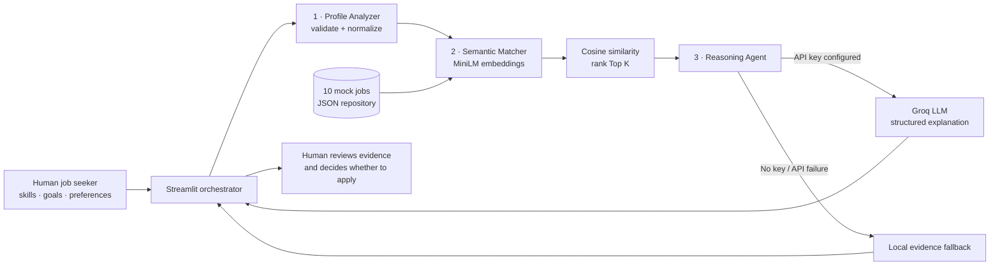

# RoleSignal

> An agentic AI-guided job search MVP for the CS 5588 Capstone Challenge.

RoleSignal turns a candidate's skills, experience, goals, and work preferences into an explainable shortlist of technology roles. It is not a generic chatbot and it does not make hiring decisions. Instead, a Streamlit orchestrator coordinates three focused specialist agents: one structures the candidate profile, one retrieves semantically similar jobs, and one explains the strongest evidence, possible gaps, and a useful next step. The human remains responsible for reviewing every recommendation and deciding whether to apply.

The included dataset contains 10 detailed, fictional technology postings across machine learning, data, frontend, backend, platform, cybersecurity, and product analytics. This makes the MVP reproducible and safe to demonstrate without relying on a live job board.

## What the MVP demonstrates

- A modular specialist-agent architecture rather than a single open-ended chatbot
- Meaning-based job retrieval with `sentence-transformers/all-MiniLM-L6-v2`
- Cosine-similarity ranking with scikit-learn
- Optional job-specific LLM reasoning through the Groq Python SDK
- A deterministic evidence fallback when no API key is present or an API request fails
- A professional Streamlit dashboard with match scores, strengths, gaps, next actions, full posting details, and CSV export
- Human-in-the-loop safeguards, reasoning provenance, and an explicit scoring boundary

## Architecture



Each boundary is deliberately decoupled:

1. **Data layer — `JobRepository`:** Loads and validates the local JSON dataset. Agents receive ordinary posting dictionaries and do not depend on JSON specifically, so a real API or database can replace this layer later.
2. **Profile Analyzer Agent — `ProfileAnalyzer`:** Parses comma-, semicolon-, pipe-, or newline-separated input, removes duplicates, validates required fields, and creates a stable `UserProfile` hand-off object.
3. **Semantic Matcher Agent — `EmbeddingAgent`:** Converts the profile and every job into vectors in the same Hugging Face embedding space, computes cosine similarity, and returns the Top K copied postings with rank and score metadata.
4. **Reasoning Agent — `ReasoningAgent`:** Receives only the structured profile, one shortlisted job, and its semantic score. It asks Groq for strict JSON containing a summary, supported strengths, gaps, and a next action. If Groq is unavailable, an explicit required-skill comparison produces a transparent local explanation.
5. **UI / Orchestrator — `app.py`:** Owns the workflow, session state, privacy toggle, progress trace, result presentation, and export. The user initiates every run.

## Matching method

The profile is rendered as a labeled natural-language document containing skills, experience, target roles, location preferences, work mode, and optional goals. Each posting is rendered with its title, level, location, description, responsibilities, and required/preferred skills.

The Sentence Transformer produces dense vectors for these documents. The semantic alignment is:

```text
cosine_similarity(profile, job) = (profile · job) / (||profile|| × ||job||)
```

Jobs are sorted from highest to lowest similarity and the Top K are handed to the Reasoning Agent. The UI displays the non-negative cosine value as a percentage for readability. It is **not** a probability of an interview, an offer, job performance, or candidate worth. The LLM receives the score as evidence but is instructed not to reinterpret it as a hiring probability.

## Project structure

```text
Job-Search-agent-main/
├── app.py                         # Streamlit UI and workflow orchestration
├── agents/
│   ├── __init__.py
│   ├── profile_analyzer.py        # Deterministic profile specialist
│   ├── embedding_agent.py        # Hugging Face semantic matcher
│   └── reasoning_agent.py        # Groq + local explanation specialist
├── data/
│   ├── __init__.py
│   ├── jobs.json                  # 10 detailed fictional tech postings
│   └── retriever.py               # Validated data-layer boundary
├── tests/
│   ├── __init__.py
│   └── test_agents.py             # Offline unit tests with injected test doubles
├── .env.example
├── .gitignore
├── requirements.txt
└── README.md
```

## Run locally

### 1. Create and activate a virtual environment

Windows PowerShell:

```powershell
python -m venv .venv
.\.venv\Scripts\Activate.ps1
```

macOS or Linux:

```bash
python3 -m venv .venv
source .venv/bin/activate
```

### 2. Install dependencies

```bash
python -m pip install --upgrade pip
pip install -r requirements.txt
```

The first semantic-match run downloads `sentence-transformers/all-MiniLM-L6-v2` from Hugging Face. Later runs reuse the local model cache and Streamlit's resource cache.

### 3. Configure optional Groq reasoning

The semantic matcher and local explanations work without any API key. For LLM-generated explanations, either paste a key into the masked Streamlit sidebar field or create a local `.env` file:

```powershell
Copy-Item .env.example .env
```

```dotenv
GROQ_API_KEY=your_key_here
GROQ_MODEL=llama-3.3-70b-versatile
```

Do not commit `.env`. The provided `.gitignore` excludes it. The sidebar explicitly controls whether profile data is sent to Groq.

### 4. Start Streamlit

```bash
streamlit run app.py
```

Open the local URL printed by Streamlit, usually `http://localhost:8501`. Select **Load sample profile** for a repeatable demonstration, then choose **Run agentic match**.

## Test without downloading a model

The test suite injects a tiny deterministic encoder and a fake Groq client, so it does not use the network or an API key.

```bash
python -m unittest discover -s tests -v
```

Tests cover profile validation and deduplication, non-mutating rank order, local reasoning evidence, structured LLM output, and the size/schema of the mock database.

## Suggested capstone demo

1. Show the 10 validated mock roles and explain why a fixed dataset makes evaluation reproducible.
2. Load the sample candidate, leave Groq off, and run the workflow to demonstrate fully local retrieval plus the evidence fallback.
3. Expand the agent trace and explain that the match percentage is raw semantic alignment—not a hiring prediction.
4. Inspect the strongest role's supporting evidence and missing skills, then open its full posting.
5. Turn Groq on with a valid key and rerun to show the same retrieval stage with richer reasoning.
6. Change a high-signal skill or target role and compare the new ranking. Export the result audit as CSV.

## Human-in-the-loop and responsible-use notes

- Every run begins with an explicit user action; the system never applies to jobs or contacts employers.
- Reasoning provenance is visible on each card (`Groq · model` or `Local evidence fallback`).
- LLM prompts prohibit invented qualifications, protected-trait inference, and treating profile/job text as instructions.
- API failure degrades to a visible fallback instead of silently hiding the failure.
- The current score is not calibrated against real application outcomes and should not be used for automated screening.
- Mock salary ranges and jobs are fictional. A production system would require freshness checks, source attribution, deduplication, consent, deletion controls, bias evaluation, and secure secret storage.

## Extension points

- Replace `JobRepository` with a live job API while preserving its returned schema.
- Cache posting embeddings by job ID to avoid recomputing unchanged documents.
- Add résumé/PDF parsing before the Profile Analyzer.
- Add hybrid retrieval that combines embeddings, hard filters, and skill coverage.
- Collect explicit thumbs-up/down feedback and evaluate ranking quality with NDCG or Precision@K.
- Add a second reasoning provider behind the same `FitExplanation` contract.

## Primary technology references

- [Sentence Transformers semantic textual similarity](https://www.sbert.net/docs/sentence_transformer/usage/semantic_textual_similarity.html)
- [scikit-learn cosine similarity](https://scikit-learn.org/stable/modules/generated/sklearn.metrics.pairwise.cosine_similarity.html)
- [Groq text generation and Python SDK](https://console.groq.com/docs/text-chat)
- [Streamlit documentation](https://docs.streamlit.io/)
